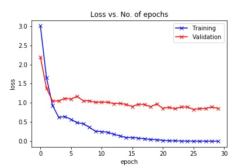
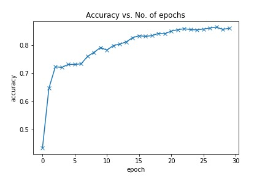
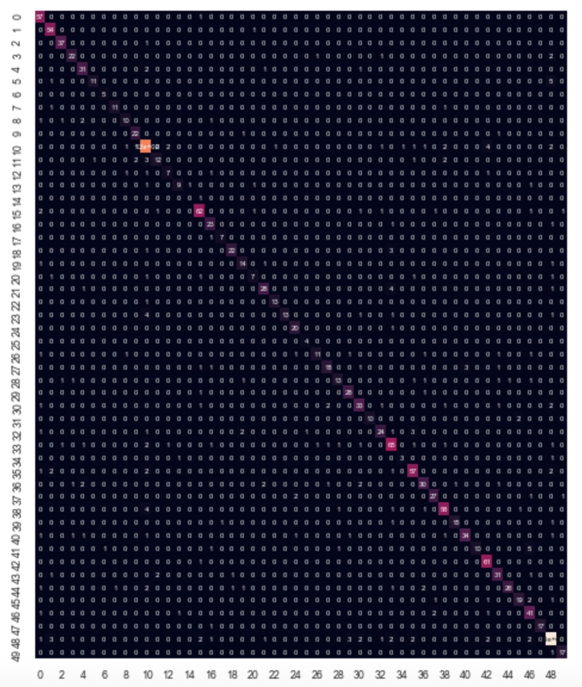

# BBM416-FinalProject

Painters want to improve their talents, and to improve themselves they need to know famous painters who have painting styles like theirs. For this aim, we decided to create a project which takes a
painting and could find the painter’s style.

The user uploads a painting, and our project identifies which famous artist’s works the uploaded painting looks like. It makes that with a dataset that has 49 different famous painters and predicts
which famous painters’ work people artwork looks like.

We used the Pretrained ResNet18 model with PyTorch to classify images into different classes. 

Dataset:https://www.kaggle.com/ikarus777/best-artworks-of-all-time

In the project, we deleted the first painter Albrecht Dürer, because the folder and image names include that could not read characters. So we train the model in 49 classes.

We achieve:

Test loss: 0.8816958069801331

Test Accuracy: 0.8461804986000061

Graph showing loss vs. number of epochs:

Graph showing accuracy vs. number of epochs:

Confusion matrix:

